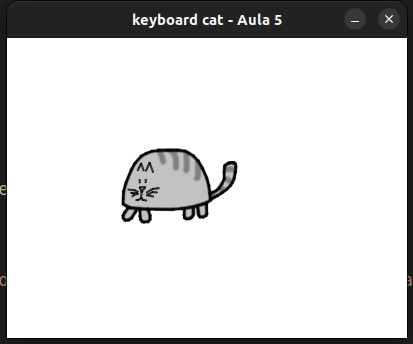

### Aula 5 Câmeras nos Jogos

Manipular a imagem do gato pelo teclado, utilize as seguintes teclas:

* Utiliza as teclas (setas) right, left, up and down para deslocar o gato.°

* d vira 90° para direita (right)

* e vira 90° para esquerda (left)

* f inverte a imagem (flip) 

exec cat-keyboard.py:

---
