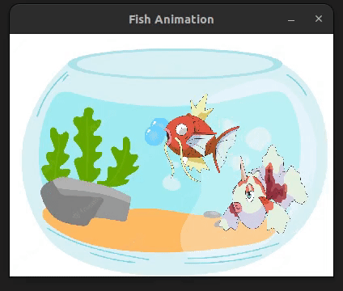

## Fish Game

### Praticando

Consiste na manipulação de frames / movimentação de imagens com pygame.

```animacao-fish.py``` execução:


### Aplicando Aquarium

Consiste na manipulação diversos elementos e movimentações.

```aquarium.py``` execução:


