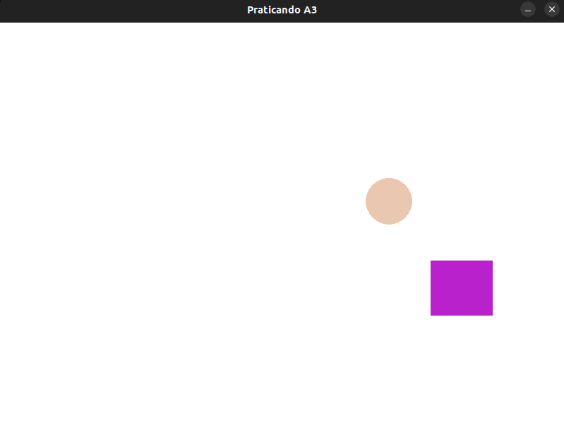
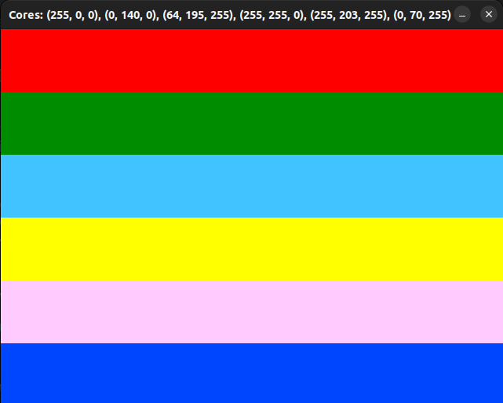

## Aula 3 - Documentação de Jogos

* Manipulação de cores

### Exercício 1

* Criação de formas na sourface com posições e tamanhos randômicos.

### Desafio

* Criar interface com variáções de cores em diversos retangulos.
* Usar função lerp.
* Variação de cores baseado na posição x, y do mouse.

